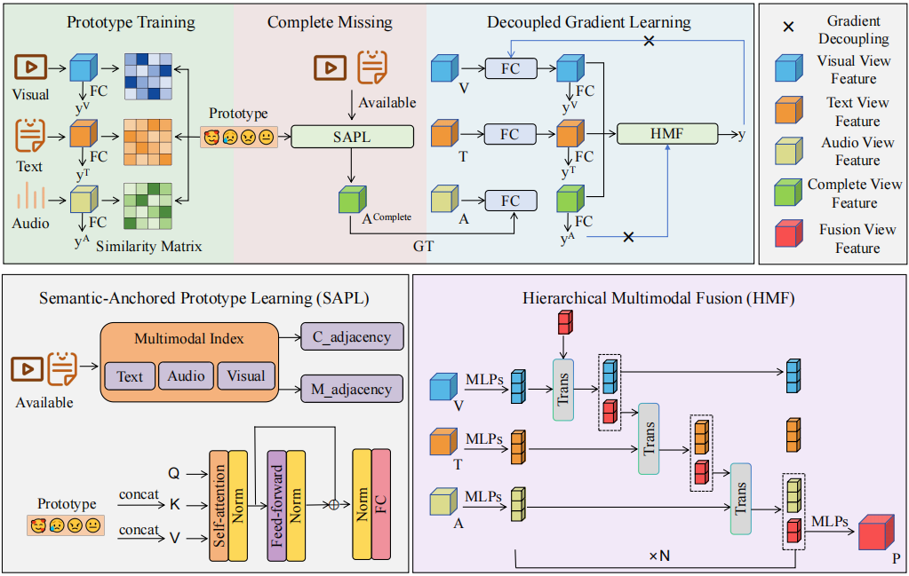

# DiSL
Discriminative Semantic Learning for Incomplete Multimodal Sentiment Analysis

  

Our DiSL framework comprises three core components: (1) Semantic-Anchored Pro- totype Learning (SAPL)
that establishes sentiment prototypes as explicit semantic references in the feature space, (2) Hierarchical Multimodal
Fusion (HMF) that progressively integrates features across multiple levels from modality-specific to cross-modal represen-
tations, and (3) Decou- pled Gradient Learning (DGL) that enables unimodal encoders to better perform discriminative
learning and improves multimodal fusion..
